# 3-Machine High Availability Solution for Cupola

## Overview
This document provides solutions for a 3-machine setup: 1 Slave, 1 Master, and 1 Spare machine that can be used as backup for either Slave or Master failures.

## 3-Machine Architecture

```mermaid
graph TB
    subgraph "📹 Cameras (99+ Cameras)"
        C1[📹 Camera 1<br/>rtmp://192.168.1.101:1935/stream1]
        C2[📹 Camera 2<br/>rtmp://192.168.1.101:1935/stream2]
        CN[📹 Camera N<br/>rtmp://192.168.1.101:1935/streamN]
    end

    subgraph "🖥️ Physical Machines"
        S1[Slave Machine<br/>Primary<br/>IP: 192.168.1.101<br/>Cupola Docker<br/>MongoDB]
        M1[Master Machine<br/>Primary<br/>IP: 192.168.1.201<br/>Cupola Docker<br/>MongoDB]
        SPARE[Spare Machine<br/>Universal Backup<br/>IP: 192.168.1.301<br/>Cupola Docker<br/>MongoDB]
    end

    subgraph "💾 Shared Storage"
        MONGO[MongoDB Replication<br/>Configuration Sync<br/>Backup & Restore]
    end

    subgraph "🔄 Network Infrastructure"
        SW[Network Switch<br/>Port Configuration<br/>VLAN Management]
    end

    subgraph "Middleware & Digital Twin"
        MW[Middleware<br/>Port Forwarding<br/>URL Management]
        DT[Digital Twin<br/>Configuration<br/>URL Updates]
    end

    %% Camera connections
    C1 -->|RTMP| SW
    C2 -->|RTMP| SW
    CN -->|RTMP| SW
    SW -->|Active| S1
    SW -.->|Failover| SPARE

    %% Slave to master
    S1 -->|Streams| M1
    S1 -.->|Backup| SPARE
    SPARE -->|Streams| M1
    SPARE -.->|Backup| M1

    %% Master to middleware
    M1 -->|Streams| MW
    SPARE -.->|Backup| MW
    MW -->|Config| DT

    %% MongoDB connections
    S1 <-->|Replication| MONGO
    M1 <-->|Replication| MONGO
    SPARE <-->|Replication| MONGO

    %% Styling
    classDef camera fill:#e1f5fe,stroke:#01579b,stroke-width:2px
    classDef slave fill:#f3e5f5,stroke:#4a148c,stroke-width:2px
    classDef master fill:#e8f5e8,stroke:#1b5e20,stroke-width:2px
    classDef spare fill:#fff3e0,stroke:#e65100,stroke-width:2px
    classDef storage fill:#f3e5f5,stroke:#7b1fa2,stroke-width:2px
    classDef network fill:#e8f5e8,stroke:#2e7d32,stroke-width:2px
    classDef middleware fill:#fff3e0,stroke:#e65100,stroke-width:2px

    class C1,C2,CN camera
    class S1 slave
    class M1 master
    class SPARE spare
    class MONGO storage
    class SW network
    class MW,DT middleware
```



## Failure Scenarios & Solutions

### **Scenario 1: Slave Machine Failure**

#### **Problem**: 
- Slave machine (192.168.1.101) goes down
- All cameras lose RTMP connection
- Spare machine needs to become new Slave

#### **Solution**: Spare Machine → New Slave


**Recovery Steps**:
1. **Detect Slave failure** (monitoring alert)
2. **Change Spare machine IP** to 192.168.1.101
3. **Restart network services**
4. **Start Cupola Docker** as Slave
5. **Verify camera connections**
6. **Update monitoring**

**Commands**:
```bash
# On Spare Machine (192.168.1.301):
# 1. Change IP to failed Slave IP
sudo ip addr del 192.168.1.301/24 dev eth0
sudo ip addr add 192.168.1.101/24 dev eth0

# 2. Restart network
sudo systemctl restart networking

# 3. Start Cupola as Slave
docker-compose -f docker-compose-slave.yml up -d

# 4. Verify services
docker ps
curl http://192.168.1.101:8080/health
```

### **Scenario 2: Master Machine Failure**

#### **Problem**: 
- Master machine (192.168.1.201) goes down
- No streams to middleware/Digital Twin
- Spare machine needs to become new Master

#### **Solution**: Spare Machine → New Master


**Recovery Steps**:
1. **Detect Master failure** (monitoring alert)
2. **Change Spare machine IP** to 192.168.1.201
3. **Restart network services**
4. **Start Cupola Docker** as Master
5. **Update middleware configuration**
6. **Update Digital Twin URLs**

**Commands**:
```bash
# On Spare Machine (192.168.1.301):
# 1. Change IP to failed Master IP
sudo ip addr del 192.168.1.301/24 dev eth0
sudo ip addr add 192.168.1.201/24 dev eth0

# 2. Restart network
sudo systemctl restart networking

# 3. Start Cupola as Master
docker-compose -f docker-compose-master.yml up -d

# 4. Update middleware and Digital Twin
# (Specific commands depend on your setup)
```

### **Scenario 3: Spare Machine Failure**

#### **Problem**: 
- Spare machine goes down
- No backup available
- Need to restore spare machine

#### **Solution**: Restore Spare Machine
```bash
# 1. Replace hardware if needed
# 2. Install OS and Docker
# 3. Restore configuration from backup
# 4. Set up MongoDB replication
# 5. Test failover capabilities
```

## Implementation Strategy

### **Phase 1: Spare Machine Setup**
1. **Install same OS** as Slave and Master
2. **Install Docker** and Cupola
3. **Set up MongoDB replication** with all machines
4. **Create configuration files** for both Slave and Master roles
5. **Test both failover scenarios**

### **Phase 2: Configuration Management**
1. **Create Docker Compose files** for each role:
   - `docker-compose-slave.yml`
   - `docker-compose-master.yml`
2. **Set up MongoDB replication** between all 3 machines
3. **Create backup scripts** for configurations
4. **Set up monitoring** for all machines

### **Phase 3: Automation**
1. **Create failover scripts** for each scenario
2. **Set up health monitoring** and alerts
3. **Test failover procedures** regularly
4. **Document recovery procedures**

## Docker Compose Configurations

### **Slave Configuration (docker-compose-slave.yml)**
```yaml
version: '3.8'
services:
  cupola-slave:
    image: cupola:latest
    ports:
      - "1935:1935"
      - "8080:8080"
    environment:
      - ROLE=slave
      - MONGODB_URI=mongodb://mongo-cluster:27017/cupola
    depends_on:
      - mongo
    restart: unless-stopped
    healthcheck:
      test: ["CMD", "curl", "-f", "http://localhost:8080/health"]
      interval: 30s
      timeout: 10s
      retries: 3

  mongo:
    image: mongo:latest
    ports:
      - "27017:27017"
    volumes:
      - mongo_data:/data/db
    restart: unless-stopped

volumes:
  mongo_data:
```

### **Master Configuration (docker-compose-master.yml)**
```yaml
version: '3.8'
services:
  cupola-master:
    image: cupola:latest
    ports:
      - "1935:1935"
      - "8080:8080"
    environment:
      - ROLE=master
      - MONGODB_URI=mongodb://mongo-cluster:27017/cupola
    depends_on:
      - mongo
    restart: unless-stopped
    healthcheck:
      test: ["CMD", "curl", "-f", "http://localhost:8080/health"]
      interval: 30s
      timeout: 10s
      retries: 3

  mongo:
    image: mongo:latest
    ports:
      - "27017:27017"
    volumes:
      - mongo_data:/data/db
    restart: unless-stopped

volumes:
  mongo_data:
```

## Monitoring & Alerting Setup

### **Health Check Script**
```bash
#!/bin/bash
# check_all_machines.sh

# Check Slave machine
if ! curl -f http://192.168.1.101:8080/health; then
    echo "Slave machine is down, initiating failover"
    ./failover_slave.sh
fi

# Check Master machine
if ! curl -f http://192.168.1.201:8080/health; then
    echo "Master machine is down, initiating failover"
    ./failover_master.sh
fi

# Check Spare machine
if ! curl -f http://192.168.1.301:8080/health; then
    echo "Spare machine is down, needs restoration"
    # Send alert for spare machine restoration
    curl -X POST "https://hooks.slack.com/your-webhook" -d '{"text":"Spare machine is down - needs restoration"}'
fi
```

### **Slave Failover Script**
```bash
#!/bin/bash
# failover_slave.sh
echo "Starting Slave failover process..."

# On Spare Machine (192.168.1.301):
# Change IP address
ssh root@192.168.1.301 "sudo ip addr del 192.168.1.301/24 dev eth0"
ssh root@192.168.1.301 "sudo ip addr add 192.168.1.101/24 dev eth0"

# Restart network
ssh root@192.168.1.301 "sudo systemctl restart networking"

# Start Slave services
ssh root@192.168.1.301 "cd /opt/cupola && docker-compose -f docker-compose-slave.yml up -d"

# Verify services
sleep 30
if curl -f http://192.168.1.101:8080/health; then
    echo "Slave failover successful"
    curl -X POST "https://hooks.slack.com/your-webhook" -d '{"text":"Slave failover completed successfully"}'
else
    echo "Slave failover failed"
    curl -X POST "https://hooks.slack.com/your-webhook" -d '{"text":"Slave failover failed - manual intervention required"}'
fi
```

### **Master Failover Script**
```bash
#!/bin/bash
# failover_master.sh
echo "Starting Master failover process..."

# On Spare Machine (192.168.1.301):
# Change IP address
ssh root@192.168.1.301 "sudo ip addr del 192.168.1.301/24 dev eth0"
ssh root@192.168.1.301 "sudo ip addr add 192.168.1.201/24 dev eth0"

# Restart network
ssh root@192.168.1.301 "sudo systemctl restart networking"

# Start Master services
ssh root@192.168.1.301 "cd /opt/cupola && docker-compose -f docker-compose-master.yml up -d"

# Update middleware and Digital Twin
# (Specific commands depend on your setup)

# Verify services
sleep 30
if curl -f http://192.168.1.201:8080/health; then
    echo "Master failover successful"
    curl -X POST "https://hooks.slack.com/your-webhook" -d '{"text":"Master failover completed successfully"}'
else
    echo "Master failover failed"
    curl -X POST "https://hooks.slack.com/your-webhook" -d '{"text":"Master failover failed - manual intervention required"}'
fi
```

## Benefits of 3-Machine Solution

### **✅ Cost Effective**
- **Only 3 machines** required
- **Universal backup** for both roles
- **No dedicated** backup machines

### **✅ Flexible**
- **Spare machine** can become either Slave or Master
- **Easy to maintain** and manage
- **Simple failover** procedures

### **✅ Reliable**
- **Quick recovery** (2-10 minutes)
- **Proven approach** for physical machines
- **Minimal downtime** during failures

### **✅ Scalable**
- **Easy to add** more spare machines
- **Flexible configuration** options
- **Room for growth**

This 3-machine solution provides everything you need for high availability with your existing hardware setup!

## Complete Configuration Steps

### **Phase 1: Initial Setup (All 3 Machines)**

#### **Step 1: OS Installation and Basic Setup**
```bash
# On all 3 machines (Slave, Master, Spare):
# 1. Install Ubuntu 20.04 LTS (or your preferred OS)
# 2. Update system
sudo apt update && sudo apt upgrade -y

# 3. Install required packages
sudo apt install -y curl wget git vim net-tools

# 4. Set hostnames
sudo hostnamectl set-hostname slave-machine    # On Slave
sudo hostnamectl set-hostname master-machine   # On Master
sudo hostnamectl set-hostname spare-machine    # On Spare

# 5. Configure static IPs
sudo nano /etc/netplan/00-installer-config.yaml
```

**Network Configuration for each machine:**
```yaml
# Slave Machine (192.168.1.101)
network:
  version: 2
  ethernets:
    eth0:
      addresses:
        - 192.168.1.101/24
      gateway4: 192.168.1.1
      nameservers:
        addresses: [8.8.8.8, 8.8.4.4]

# Master Machine (192.168.1.201)
network:
  version: 2
  ethernets:
    eth0:
      addresses:
        - 192.168.1.201/24
      gateway4: 192.168.1.1
      nameservers:
        addresses: [8.8.8.8, 8.8.4.4]

# Spare Machine (192.168.1.301)
network:
  version: 2
  ethernets:
    eth0:
      addresses:
        - 192.168.1.301/24
      gateway4: 192.168.1.1
      nameservers:
        addresses: [8.8.8.8, 8.8.4.4]
```

```bash
# Apply network configuration
sudo netplan apply

# 6. Reboot all machines
sudo reboot
```

#### **Step 2: Docker Installation**
```bash
# On all 3 machines:
# 1. Install Docker
curl -fsSL https://get.docker.com -o get-docker.sh
sudo sh get-docker.sh

# 2. Add user to docker group
sudo usermod -aG docker $USER

# 3. Install Docker Compose
sudo curl -L "https://github.com/docker/compose/releases/download/v2.20.0/docker-compose-$(uname -s)-$(uname -m)" -o /usr/local/bin/docker-compose
sudo chmod +x /usr/local/bin/docker-compose

# 4. Verify installation
docker --version
docker-compose --version

# 5. Enable Docker service
sudo systemctl enable docker
sudo systemctl start docker
```

#### **Step 3: MongoDB Installation and Configuration**
```bash
# On all 3 machines:
# 1. Create MongoDB data directory
sudo mkdir -p /opt/mongodb/data
sudo chown -R 999:999 /opt/mongodb

# 2. Create MongoDB configuration
sudo mkdir -p /opt/cupola/config
sudo nano /opt/cupola/config/mongod.conf
```

**MongoDB Configuration (`/opt/cupola/config/mongod.conf`):**
```yaml
storage:
  dbPath: /data/db
  journal:
    enabled: true

systemLog:
  destination: file
  logAppend: true
  path: /var/log/mongodb/mongod.log

net:
  port: 27017
  bindIp: 0.0.0.0

replication:
  replSetName: "cupola-replica-set"
```

#### **Step 4: Cupola Application Setup**
```bash
# On all 3 machines:
# 1. Create application directory
sudo mkdir -p /opt/cupola
cd /opt/cupola

# 2. Create directory structure
mkdir -p {config,scripts,backups,logs}

# 3. Download Cupola Docker image (replace with your actual image)
# docker pull your-cupola-image:latest

# 4. Create environment files
sudo nano /opt/cupola/.env
```

**Environment Configuration (`.env`):**
```bash
# Common settings
MONGODB_URI=mongodb://mongo:27017/cupola
CUPOLA_PORT=8080
RTMP_PORT=1935

# Machine-specific settings
# Slave Machine
MACHINE_ROLE=slave
MACHINE_IP=192.168.1.101

# Master Machine  
MACHINE_ROLE=master
MACHINE_IP=192.168.1.201

# Spare Machine
MACHINE_ROLE=spare
MACHINE_IP=192.168.1.301
```

### **Phase 2: Docker Compose Configuration**

#### **Step 5: Create Docker Compose Files**

**Slave Configuration (`docker-compose-slave.yml`):**
```yaml
version: '3.8'
services:
  cupola-slave:
    image: cupola:latest
    container_name: cupola-slave
    ports:
      - "1935:1935"
      - "8080:8080"
    environment:
      - ROLE=slave
      - MONGODB_URI=mongodb://mongo:27017/cupola
      - MACHINE_IP=192.168.1.101
    volumes:
      - ./config:/app/config
      - ./logs:/app/logs
    depends_on:
      - mongo
    restart: unless-stopped
    healthcheck:
      test: ["CMD", "curl", "-f", "http://localhost:8080/health"]
      interval: 30s
      timeout: 10s
      retries: 3
      start_period: 40s

  mongo:
    image: mongo:6.0
    container_name: mongo-slave
    ports:
      - "27017:27017"
    volumes:
      - mongo_data:/data/db
      - ./config/mongod.conf:/etc/mongod.conf
    command: mongod --config /etc/mongod.conf
    restart: unless-stopped

volumes:
  mongo_data:
```

**Master Configuration (`docker-compose-master.yml`):**
```yaml
version: '3.8'
services:
  cupola-master:
    image: cupola:latest
    container_name: cupola-master
    ports:
      - "1935:1935"
      - "8080:8080"
    environment:
      - ROLE=master
      - MONGODB_URI=mongodb://mongo:27017/cupola
      - MACHINE_IP=192.168.1.201
    volumes:
      - ./config:/app/config
      - ./logs:/app/logs
    depends_on:
      - mongo
    restart: unless-stopped
    healthcheck:
      test: ["CMD", "curl", "-f", "http://localhost:8080/health"]
      interval: 30s
      timeout: 10s
      retries: 3
      start_period: 40s

  mongo:
    image: mongo:6.0
    container_name: mongo-master
    ports:
      - "27017:27017"
    volumes:
      - mongo_data:/data/db
      - ./config/mongod.conf:/etc/mongod.conf
    command: mongod --config /etc/mongod.conf
    restart: unless-stopped

volumes:
  mongo_data:
```

**Spare Configuration (`docker-compose-spare.yml`):**
```yaml
version: '3.8'
services:
  cupola-spare:
    image: cupola:latest
    container_name: cupola-spare
    ports:
      - "1935:1935"
      - "8080:8080"
    environment:
      - ROLE=spare
      - MONGODB_URI=mongodb://mongo:27017/cupola
      - MACHINE_IP=192.168.1.301
    volumes:
      - ./config:/app/config
      - ./logs:/app/logs
    depends_on:
      - mongo
    restart: unless-stopped
    healthcheck:
      test: ["CMD", "curl", "-f", "http://localhost:8080/health"]
      interval: 30s
      timeout: 10s
      retries: 3
      start_period: 40s

  mongo:
    image: mongo:6.0
    container_name: mongo-spare
    ports:
      - "27017:27017"
    volumes:
      - mongo_data:/data/db
      - ./config/mongod.conf:/etc/mongod.conf
    command: mongod --config /etc/mongod.conf
    restart: unless-stopped

volumes:
  mongo_data:
```

### **Phase 3: MongoDB Replication Setup**

#### **Step 6: Configure MongoDB Replica Set**
```bash
# On Slave Machine (192.168.1.101):
# 1. Start MongoDB
cd /opt/cupola
docker-compose -f docker-compose-slave.yml up -d

# 2. Wait for MongoDB to start
sleep 30

# 3. Initialize replica set
docker exec -it mongo-slave mongosh --eval "
rs.initiate({
  _id: 'cupola-replica-set',
  members: [
    { _id: 0, host: '192.168.1.101:27017', priority: 2 },
    { _id: 1, host: '192.168.1.201:27017', priority: 1 },
    { _id: 2, host: '192.168.1.301:27017', priority: 1 }
  ]
})
"
```

#### **Step 7: Start All Services**
```bash
# On Master Machine (192.168.1.201):
cd /opt/cupola
docker-compose -f docker-compose-master.yml up -d

# On Spare Machine (192.168.1.301):
cd /opt/cupola
docker-compose -f docker-compose-spare.yml up -d

# Verify all services are running
docker ps
```

### **Phase 4: Monitoring and Scripts Setup**

#### **Step 8: Create Monitoring Scripts**
```bash
# On all 3 machines:
# 1. Create monitoring directory
sudo mkdir -p /opt/monitoring
cd /opt/monitoring

# 2. Create health check script
sudo nano health_check.sh
```

**Health Check Script (`health_check.sh`):**
```bash
#!/bin/bash

# Health check script for 3-machine setup
LOG_FILE="/opt/monitoring/health_check.log"
DATE=$(date '+%Y-%m-%d %H:%M:%S')

# Function to log messages
log_message() {
    echo "[$DATE] $1" >> $LOG_FILE
}

# Check Slave machine
check_slave() {
    if curl -f http://192.168.1.101:8080/health >/dev/null 2>&1; then
        log_message "Slave machine (192.168.1.101) is UP"
        return 0
    else
        log_message "Slave machine (192.168.1.101) is DOWN"
        return 1
    fi
}

# Check Master machine
check_master() {
    if curl -f http://192.168.1.201:8080/health >/dev/null 2>&1; then
        log_message "Master machine (192.168.1.201) is UP"
        return 0
    else
        log_message "Master machine (192.168.1.201) is DOWN"
        return 1
    fi
}

# Check Spare machine
check_spare() {
    if curl -f http://192.168.1.301:8080/health >/dev/null 2>&1; then
        log_message "Spare machine (192.168.1.301) is UP"
        return 0
    else
        log_message "Spare machine (192.168.1.301) is DOWN"
        return 1
    fi
}

# Main health check
log_message "Starting health check..."

if ! check_slave; then
    log_message "Initiating Slave failover..."
    /opt/monitoring/failover_slave.sh
fi

if ! check_master; then
    log_message "Initiating Master failover..."
    /opt/monitoring/failover_master.sh
fi

if ! check_spare; then
    log_message "Spare machine is down - needs restoration"
    # Send alert
    curl -X POST "https://hooks.slack.com/your-webhook" -d '{"text":"Spare machine is down - needs restoration"}' 2>/dev/null || true
fi

log_message "Health check completed"
```

#### **Step 9: Create Failover Scripts**

**Slave Failover Script (`failover_slave.sh`):**
```bash
#!/bin/bash

# Slave failover script
LOG_FILE="/opt/monitoring/failover.log"
DATE=$(date '+%Y-%m-%d %H:%M:%S')

log_message() {
    echo "[$DATE] $1" >> $LOG_FILE
}

log_message "Starting Slave failover process..."

# Check if spare machine is available
if ! curl -f http://192.168.1.301:8080/health >/dev/null 2>&1; then
    log_message "ERROR: Spare machine is not available for failover"
    exit 1
fi

# Change spare machine IP to slave IP
log_message "Changing spare machine IP from 192.168.1.301 to 192.168.1.101"

# SSH to spare machine and change IP
ssh root@192.168.1.301 << 'EOF'
# Change IP address
sudo ip addr del 192.168.1.301/24 dev eth0
sudo ip addr add 192.168.1.101/24 dev eth0

# Restart network
sudo systemctl restart networking

# Wait for network to come up
sleep 10

# Start Slave services
cd /opt/cupola
docker-compose -f docker-compose-slave.yml down
docker-compose -f docker-compose-slave.yml up -d

# Wait for services to start
sleep 30

# Verify services
if curl -f http://192.168.1.101:8080/health; then
    echo "Slave failover successful"
else
    echo "Slave failover failed"
    exit 1
fi
EOF

if [ $? -eq 0 ]; then
    log_message "Slave failover completed successfully"
    # Send success notification
    curl -X POST "https://hooks.slack.com/your-webhook" -d '{"text":"Slave failover completed successfully"}' 2>/dev/null || true
else
    log_message "Slave failover failed"
    # Send failure notification
    curl -X POST "https://hooks.slack.com/your-webhook" -d '{"text":"Slave failover failed - manual intervention required"}' 2>/dev/null || true
fi
```

**Master Failover Script (`failover_master.sh`):**
```bash
#!/bin/bash

# Master failover script
LOG_FILE="/opt/monitoring/failover.log"
DATE=$(date '+%Y-%m-%d %H:%M:%S')

log_message() {
    echo "[$DATE] $1" >> $LOG_FILE
}

log_message "Starting Master failover process..."

# Check if spare machine is available
if ! curl -f http://192.168.1.301:8080/health >/dev/null 2>&1; then
    log_message "ERROR: Spare machine is not available for failover"
    exit 1
fi

# Change spare machine IP to master IP
log_message "Changing spare machine IP from 192.168.1.301 to 192.168.1.201"

# SSH to spare machine and change IP
ssh root@192.168.1.301 << 'EOF'
# Change IP address
sudo ip addr del 192.168.1.301/24 dev eth0
sudo ip addr add 192.168.1.201/24 dev eth0

# Restart network
sudo systemctl restart networking

# Wait for network to come up
sleep 10

# Start Master services
cd /opt/cupola
docker-compose -f docker-compose-master.yml down
docker-compose -f docker-compose-master.yml up -d

# Wait for services to start
sleep 30

# Verify services
if curl -f http://192.168.1.201:8080/health; then
    echo "Master failover successful"
else
    echo "Master failover failed"
    exit 1
fi
EOF

if [ $? -eq 0 ]; then
    log_message "Master failover completed successfully"
    # Send success notification
    curl -X POST "https://hooks.slack.com/your-webhook" -d '{"text":"Master failover completed successfully"}' 2>/dev/null || true
else
    log_message "Master failover failed"
    # Send failure notification
    curl -X POST "https://hooks.slack.com/your-webhook" -d '{"text":"Master failover failed - manual intervention required"}' 2>/dev/null || true
fi
```

#### **Step 10: Setup Cron Jobs and Automation**
```bash
# On all 3 machines:
# 1. Make scripts executable
sudo chmod +x /opt/monitoring/*.sh

# 2. Setup SSH key authentication between machines
# Generate SSH key on each machine
ssh-keygen -t rsa -b 4096 -f ~/.ssh/id_rsa -N ""

# Copy public keys to other machines
ssh-copy-id root@192.168.1.101  # From Master and Spare
ssh-copy-id root@192.168.1.201  # From Slave and Spare
ssh-copy-id root@192.168.1.301  # From Slave and Master

# 3. Setup cron job for health monitoring
sudo crontab -e

# Add this line to run health check every 2 minutes:
*/2 * * * * /opt/monitoring/health_check.sh

# 4. Setup log rotation
sudo nano /etc/logrotate.d/cupola-monitoring
```

**Log Rotation Configuration:**
```
/opt/monitoring/*.log {
    daily
    missingok
    rotate 7
    compress
    delaycompress
    notifempty
    create 644 root root
}
```

### **Phase 5: Testing and Validation**

#### **Step 11: Test Failover Scenarios**
```bash
# Test 1: Slave machine failure simulation
# 1. Stop Slave services
ssh root@192.168.1.101 "cd /opt/cupola && docker-compose -f docker-compose-slave.yml down"

# 2. Wait for health check to detect failure (2 minutes)
# 3. Verify failover to spare machine
# 4. Check camera connections

# Test 2: Master machine failure simulation
# 1. Stop Master services
ssh root@192.168.1.201 "cd /opt/cupola && docker-compose -f docker-compose-master.yml down"

# 2. Wait for health check to detect failure (2 minutes)
# 3. Verify failover to spare machine
# 4. Check middleware and Digital Twin connections

# Test 3: Spare machine failure simulation
# 1. Stop Spare services
ssh root@192.168.1.301 "cd /opt/cupola && docker-compose -f docker-compose-spare.yml down"

# 2. Verify system continues with 2 machines
# 3. Restore spare machine when possible
```

#### **Step 12: Documentation and Maintenance**
```bash
# 1. Create maintenance documentation
sudo nano /opt/cupola/MAINTENANCE.md

# 2. Create backup scripts
sudo nano /opt/cupola/backup_config.sh

# 3. Create restore scripts
sudo nano /opt/cupola/restore_config.sh

# 4. Setup regular backups
sudo crontab -e
# Add: 0 2 * * * /opt/cupola/backup_config.sh
```

## Summary of Configuration Steps

1. **Phase 1**: OS setup, Docker installation, MongoDB configuration
2. **Phase 2**: Docker Compose files for each machine role
3. **Phase 3**: MongoDB replication setup
4. **Phase 4**: Monitoring scripts and automation
5. **Phase 5**: Testing and validation

This complete configuration guide provides all the steps needed to set up your 3-machine high availability solution!
