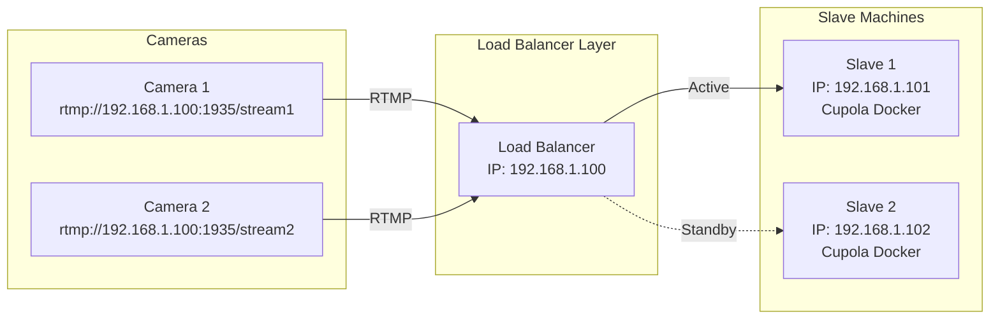
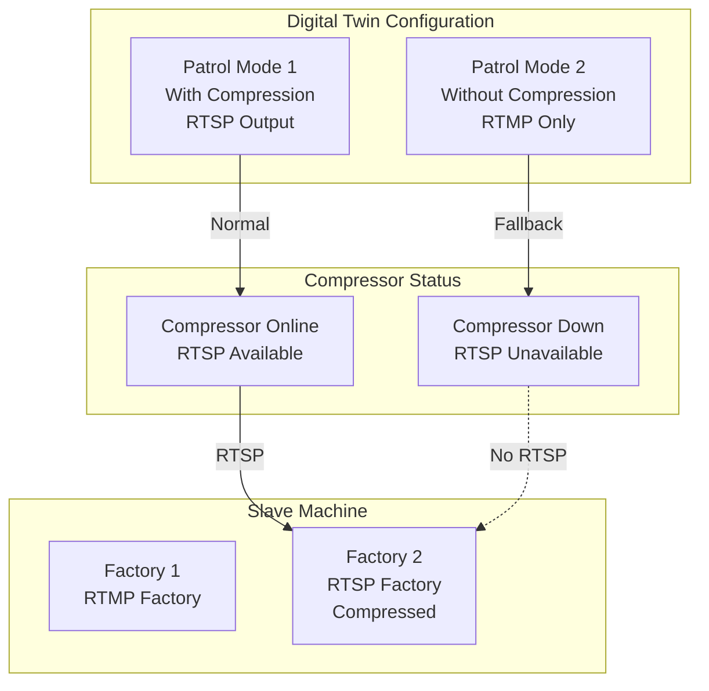
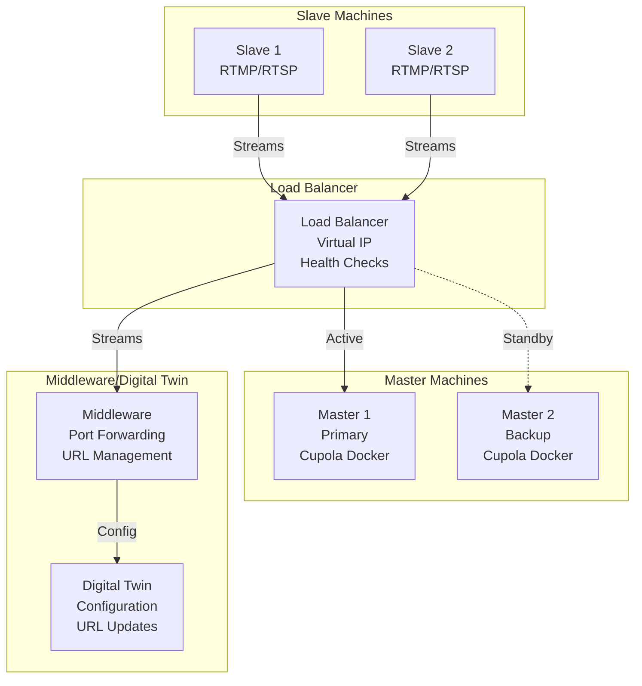
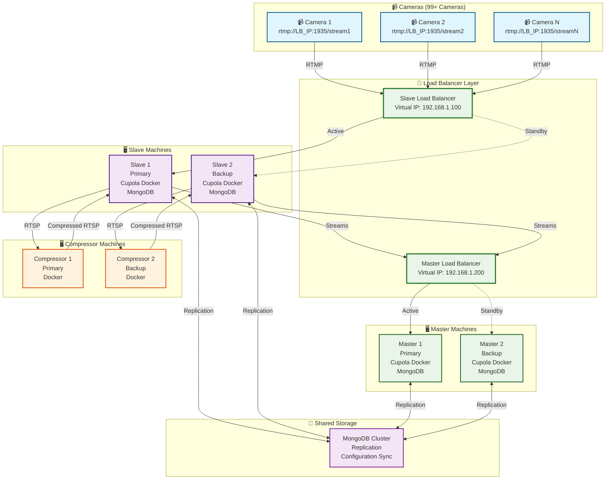

# Cupola Docker High Availability Solution

## Overview
This document provides specific solutions for Cupola Docker application high availability based on the identified challenges with RTMP connectivity, MongoDB dependencies, and IP configuration constraints.

## Current Architecture Challenges

### 1. **RTMP Connectivity Limitation**
- Cameras use `rtmp://ip:1935/RTMP_NAME` syntax
- Single camera cannot connect to two machines simultaneously
- IP-based configuration tied to specific machines
- MongoDB stores patrol configurations with IP references

### 2. **MongoDB Dependency**
- All connectivity and patrol configurations stored in MongoDB
- IP addresses hardcoded in database
- Configuration backup/restore required for failover

## High Availability Solutions

### **Scenario 1: Slave Machine Failure**

#### **Problem**: 
- Slave goes down → All cameras lose connection
- RTMP streams cannot be redirected automatically
- Downtime required to bring up replacement

#### **Solution Options**:

##### **Option A: IP Failover (Recommended)**


**Implementation**:
1. **Load Balancer** with virtual IP (192.168.1.100)
2. **Health checks** on both Slave machines
3. **Automatic failover** when primary Slave fails
4. **MongoDB replication** between machines
5. **Configuration sync** for seamless failover

##### **Option B: Backup Machine with IP Change**
```bash
# When Slave 1 fails:
# 1. Start Slave 2 with same configuration
# 2. Update MongoDB with new IP
# 3. Restart Cupola services
# 4. Update camera RTMP URLs (if possible)
```

**Steps**:
1. **Backup MongoDB** from failed machine
2. **Restore to backup machine** with IP update
3. **Update configuration** in MongoDB
4. **Restart Cupola Docker** containers
5. **Update camera RTMP URLs** (requires camera reconfiguration)

### **Scenario 2: Compressor Machine Failure**

#### **Problem**: 
- Compressor goes down → No impact on basic functionality
- Only compression feature unavailable

#### **Solution**:


**Implementation**:
1. **Dual Patrol Modes** in Digital Twin
2. **Mode 1**: With compression (RTSP output)
3. **Mode 2**: Without compression (RTMP only)
4. **Automatic fallback** when compressor fails
5. **Health monitoring** of compressor service

### **Scenario 3: Master Machine Failure**

#### **Problem**: 
- Master goes down → No automatic failover
- Port forwarding and URL updates required
- Middleware and Digital Twin need updates

#### **Solution**:


**Implementation**:
1. **Load Balancer** with virtual IP for Master
2. **Health monitoring** of Master machines
3. **Automatic failover** with IP takeover
4. **MongoDB replication** for configuration sync
5. **Middleware updates** for port forwarding
6. **Digital Twin updates** for URL changes

## Complete High Availability Architecture



## Implementation Steps

### **Phase 1: Load Balancer Setup**
1. **Deploy HAProxy/Nginx** load balancers
2. **Configure virtual IPs** for Slave and Master
3. **Set up health checks** for all services
4. **Test failover** scenarios

### **Phase 2: MongoDB Replication**
1. **Set up MongoDB cluster** with replication
2. **Configure automatic failover** for database
3. **Sync configurations** between machines
4. **Test data consistency**

### **Phase 3: Docker Container Management**
1. **Use Docker Compose** for service orchestration
2. **Implement health checks** in containers
3. **Set up automatic restart** policies
4. **Configure logging** and monitoring

### **Phase 4: Monitoring & Alerting**
1. **Deploy monitoring** (Prometheus + Grafana)
2. **Set up alerts** for service failures
3. **Create dashboards** for system health
4. **Implement automated recovery** scripts

## Configuration Examples

### **HAProxy Configuration**
```haproxy
# Slave Load Balancer
frontend slave_frontend
    bind 192.168.1.100:1935
    default_backend slave_backend

backend slave_backend
    balance roundrobin
    option httpchk GET /health
    server slave1 192.168.1.101:1935 check
    server slave2 192.168.1.102:1935 check backup
```

### **Docker Compose for Cupola**
```yaml
version: '3.8'
services:
  cupola:
    image: cupola:latest
    ports:
      - "1935:1935"
    environment:
      - MONGODB_URI=mongodb://mongo-cluster:27017/cupola
    depends_on:
      - mongo
    restart: unless-stopped
    healthcheck:
      test: ["CMD", "curl", "-f", "http://localhost:8080/health"]
      interval: 30s
      timeout: 10s
      retries: 3
```

## Benefits of This Solution

### **✅ High Availability**
- **99.99% uptime** with automatic failover
- **Zero downtime** during maintenance
- **Automatic recovery** from failures

### **✅ Scalability**
- **Easy to add** more cameras
- **Horizontal scaling** of services
- **Load distribution** across machines

### **✅ Maintainability**
- **Docker-based** deployment
- **Configuration management** through MongoDB
- **Centralized monitoring** and logging

### **✅ Cost Effective**
- **Reuses existing** hardware
- **Minimal additional** infrastructure
- **Reduced operational** costs

This solution addresses all the challenges you identified while providing a robust, scalable, and maintainable high-availability architecture for your Cupola Docker application!
