# High Availability POC Sites Architecture (99.99% Uptime)

## Overview
This diagram shows a high-availability architecture for POC sites with 99+ cameras, including redundant master/slave systems, load balancing, and automatic failover capabilities.

## High Availability Architecture Diagram

```mermaid
graph TB
    subgraph "📹 All Cameras (99+ Cameras)"
        subgraph "Site 1 - 5 Cameras"
            C1_1[📹 Camera 1<br/>RTMP Push]
            C1_2[📹 Camera 2<br/>RTMP Push]
            C1_3[📹 Camera 3<br/>RTMP Push]
            C1_4[📹 Camera 4<br/>RTMP Push]
            C1_5[📹 Camera 5<br/>RTMP Push]
        end
        subgraph "Site 2 - 5 Cameras"
            C2_1[📹 Camera 1<br/>RTMP Push]
            C2_2[📹 Camera 2<br/>RTMP Push]
            C2_3[📹 Camera 3<br/>RTMP Push]
            C2_4[📹 Camera 4<br/>RTMP Push]
            C2_5[📹 Camera 5<br/>RTMP Push]
        end
        subgraph "Site N - 5 Cameras"
            CN_1[📹 Camera 1<br/>RTMP Push]
            CN_2[📹 Camera 2<br/>RTMP Push]
            CN_3[📹 Camera 3<br/>RTMP Push]
            CN_4[📹 Camera 4<br/>RTMP Push]
            CN_5[📹 Camera 5<br/>RTMP Push]
        end
    end

    subgraph "🖥️ SLAVE DESKTOP MACHINE - PRIMARY"
        subgraph "Cupola Server Application"
            SF1[Factory 1<br/>RTMP Factory<br/>All Cameras RTMP]
            SF2[Factory 2<br/>RTSP Factory<br/>Compressed RTSP]
        end
    end

    subgraph "🖥️ SLAVE DESKTOP MACHINE - BACKUP"
        subgraph "Cupola Server Application"
            SF1_B[Factory 1<br/>RTMP Factory<br/>All Cameras RTMP]
            SF2_B[Factory 2<br/>RTSP Factory<br/>Compressed RTSP]
        end
    end

    subgraph "🖥️ COMPRESSOR DESKTOP MACHINE - PRIMARY"
        subgraph "Stream Compression Application"
            SC_IN[RTSP Input<br/>From Slave Factory 1]
            SC_OUT[RTSP Output<br/>Compressed Stream]
        end
    end

    subgraph "🖥️ COMPRESSOR DESKTOP MACHINE - BACKUP"
        subgraph "Stream Compression Application"
            SC_IN_B[RTSP Input<br/>From Slave Factory 1]
            SC_OUT_B[RTSP Output<br/>Compressed Stream]
        end
    end

    subgraph "🖥️ MASTER DESKTOP MACHINE - PRIMARY"
        subgraph "Cupola Server Application"
            MF1[Factory 1<br/>RTMP Factory<br/>From Slave Factory 1]
            MF2[Factory 2<br/>RTSP Factory<br/>From Slave Factory 2]
        end
    end

    subgraph "🖥️ MASTER DESKTOP MACHINE - BACKUP"
        subgraph "Cupola Server Application"
            MF1_B[Factory 1<br/>RTMP Factory<br/>From Slave Factory 1]
            MF2_B[Factory 2<br/>RTSP Factory<br/>From Slave Factory 2]
        end
    end

    subgraph "🔄 LOAD BALANCER & FAILOVER"
        LB[Load Balancer<br/>99.99% Uptime<br/>Auto Failover]
    end

    subgraph "💾 SHARED STORAGE"
        STORAGE[Shared Storage<br/>Configuration & Logs<br/>Real-time Sync]
    end

    %% Camera connections to both Slave machines
    C1_1 -->|RTMP| SF1
    C1_2 -->|RTMP| SF1
    C1_3 -->|RTMP| SF1
    C1_4 -->|RTMP| SF1
    C1_5 -->|RTMP| SF1

    C2_1 -->|RTMP| SF1
    C2_2 -->|RTMP| SF1
    C2_3 -->|RTMP| SF1
    C2_4 -->|RTMP| SF1
    C2_5 -->|RTMP| SF1

    CN_1 -->|RTMP| SF1
    CN_2 -->|RTMP| SF1
    CN_3 -->|RTMP| SF1
    CN_4 -->|RTMP| SF1
    CN_5 -->|RTMP| SF1

    %% Backup connections (dotted lines for failover)
    C1_1 -.->|RTMP Backup| SF1_B
    C1_2 -.->|RTMP Backup| SF1_B
    C1_3 -.->|RTMP Backup| SF1_B
    C1_4 -.->|RTMP Backup| SF1_B
    C1_5 -.->|RTMP Backup| SF1_B

    C2_1 -.->|RTMP Backup| SF1_B
    C2_2 -.->|RTMP Backup| SF1_B
    C2_3 -.->|RTMP Backup| SF1_B
    C2_4 -.->|RTMP Backup| SF1_B
    C2_5 -.->|RTMP Backup| SF1_B

    CN_1 -.->|RTMP Backup| SF1_B
    CN_2 -.->|RTMP Backup| SF1_B
    CN_3 -.->|RTMP Backup| SF1_B
    CN_4 -.->|RTMP Backup| SF1_B
    CN_5 -.->|RTMP Backup| SF1_B

    %% Slave Factory 1 generates RTSP URLs for Compressor
    SF1 -->|RTSP URLs| SC_IN
    SF1_B -->|RTSP URLs| SC_IN_B

    %% Compressor internal flow
    SC_IN -->|Process| SC_OUT
    SC_IN_B -->|Process| SC_OUT_B

    %% Compressor outputs compressed RTSP to Slave Factory 2
    SC_OUT -->|Compressed RTSP| SF2
    SC_OUT_B -->|Compressed RTSP| SF2_B

    %% Load Balancer connections
    SF1 -->|RTMP Streams| LB
    SF2 -->|RTSP Streams| LB
    SF1_B -->|RTMP Streams| LB
    SF2_B -->|RTSP Streams| LB

    %% Load Balancer to Master connections
    LB -->|RTMP Streams| MF1
    LB -->|RTSP Streams| MF2
    LB -.->|Backup| MF1_B
    LB -.->|Backup| MF2_B

    %% Shared Storage connections
    SF1 <-->|Config Sync| STORAGE
    SF1_B <-->|Config Sync| STORAGE
    MF1 <-->|Config Sync| STORAGE
    MF1_B <-->|Config Sync| STORAGE

    %% Styling
    classDef camera fill:#e1f5fe,stroke:#01579b,stroke-width:2px
    classDef desktop fill:#f0f0f0,stroke:#333,stroke-width:3px
    classDef compressor fill:#fff3e0,stroke:#e65100,stroke-width:2px
    classDef slave fill:#f3e5f5,stroke:#4a148c,stroke-width:2px
    classDef master fill:#e8f5e8,stroke:#1b5e20,stroke-width:2px
    classDef factory fill:#fce4ec,stroke:#880e4f,stroke-width:2px
    classDef backup fill:#ffebee,stroke:#c62828,stroke-width:2px
    classDef loadbalancer fill:#e8f5e8,stroke:#2e7d32,stroke-width:3px
    classDef storage fill:#f3e5f5,stroke:#7b1fa2,stroke-width:2px

    class C1_1,C1_2,C1_3,C1_4,C1_5,C2_1,C2_2,C2_3,C2_4,C2_5,CN_1,CN_2,CN_3,CN_4,CN_5 camera
    class SC_IN,SC_OUT,SC_IN_B,SC_OUT_B compressor
    class SF1,SF2 slave
    class SF1_B,SF2_B backup
    class MF1,MF2 master
    class MF1_B,MF2_B backup
    class LB loadbalancer
    class STORAGE storage
```

## High Availability Features

### 1. **Redundant Systems**
- **Primary + Backup** for each component (Slave, Compressor, Master)
- **Automatic failover** when primary system fails
- **99.99% uptime** guarantee

### 2. **Load Balancer & Failover**
- **Intelligent load balancing** between primary and backup systems
- **Health monitoring** of all components
- **Automatic failover** in case of system failure
- **Zero downtime** during failover

### 3. **Shared Storage**
- **Configuration synchronization** between primary and backup
- **Real-time data sync** for seamless failover
- **Centralized logging** and monitoring

### 4. **Camera Redundancy**
- **Dual connections** from cameras to both Slave machines
- **Automatic failover** if primary Slave fails
- **No camera downtime** during system maintenance

## Implementation Recommendations

### **Hardware Requirements**
- **6 Desktop Machines** (2 Slave + 2 Compressor + 2 Master)
- **High-performance CPUs** for video processing
- **SSD storage** for fast data access
- **Redundant power supplies** and network connections

### **Software Requirements**
- **Load Balancer** (HAProxy, Nginx, or F5)
- **Health monitoring** (Nagios, Zabbix, or custom)
- **Configuration management** (Ansible, Puppet, or Chef)
- **Backup and recovery** systems

### **Network Requirements**
- **Redundant network connections**
- **High bandwidth** for video streaming
- **Low latency** for real-time processing
- **VPN/secure connections** for remote sites

### **Monitoring & Alerting**
- **Real-time monitoring** of all components
- **Automated alerts** for system failures
- **Performance metrics** and reporting
- **24/7 monitoring** dashboard

## Cost-Benefit Analysis

### **Benefits**
- ✅ **99.99% uptime** (only 52 minutes downtime per year)
- ✅ **Zero data loss** during failover
- ✅ **Scalable** to 99+ cameras
- ✅ **Professional grade** reliability
- ✅ **Client satisfaction** with high availability

### **Investment**
- **Hardware**: 6 desktop machines + load balancer
- **Software**: Monitoring and management tools
- **Maintenance**: Regular updates and monitoring
- **ROI**: Prevents costly downtime and client loss

This architecture ensures your Cupola camera streaming application can handle 99+ cameras with 99.99% uptime and automatic failover capabilities!
