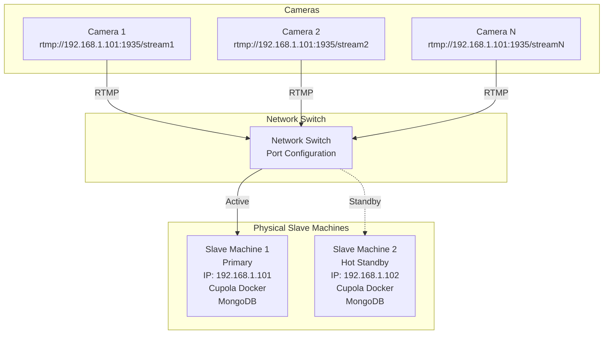
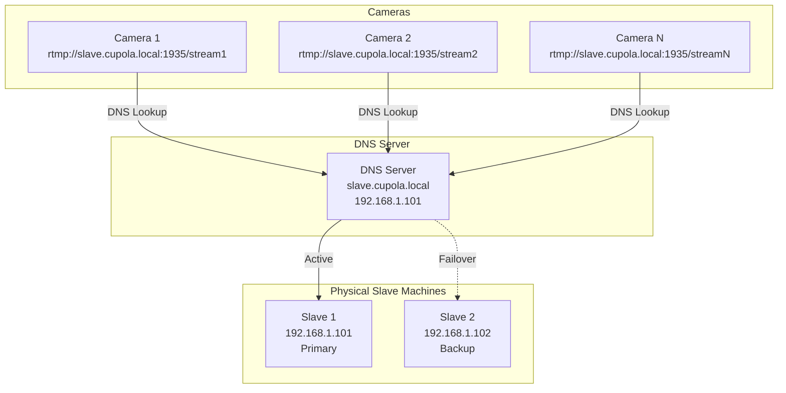
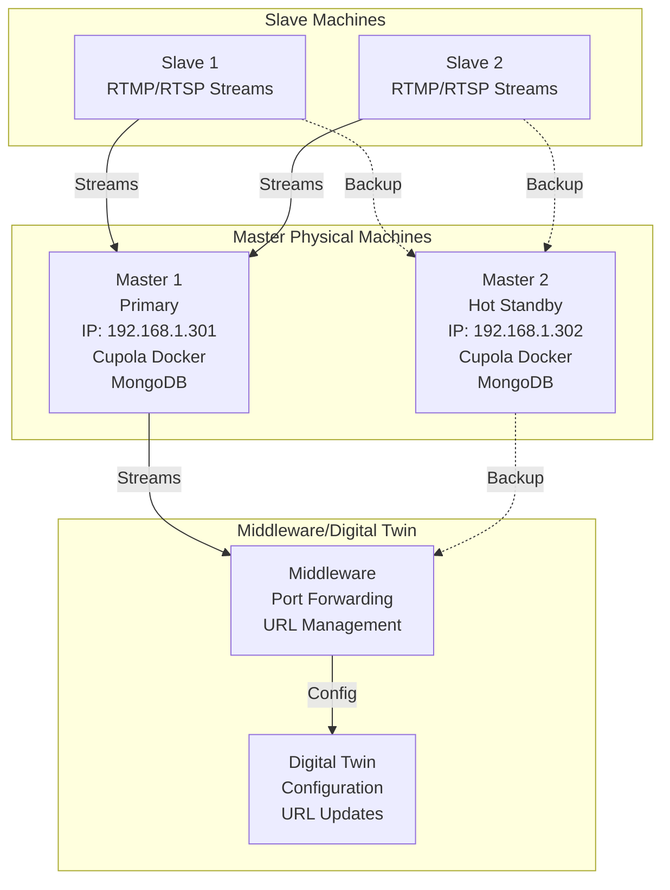
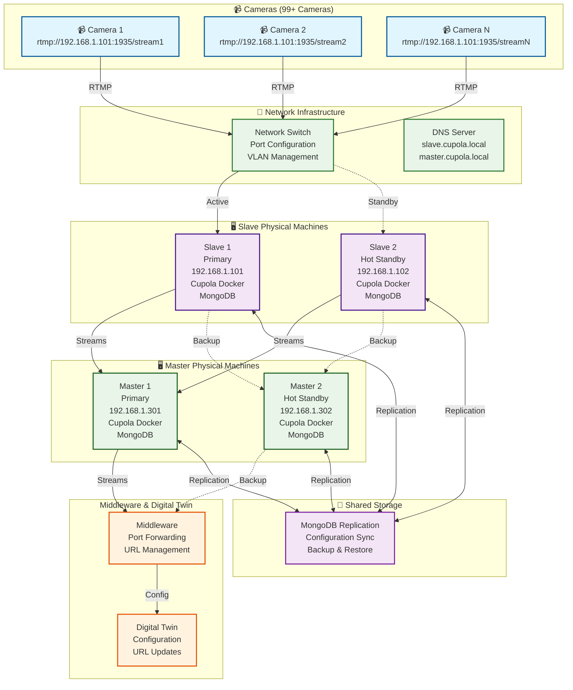

# Master & Slave Physical Machine High Availability Solution

## Overview
This document provides focused solutions for Master and Slave physical machine failures in Cupola Docker architecture, excluding compressor scenarios.

## Physical Machine Failure Scenarios & Solutions

### **Scenario 1: Slave Physical Machine Failure**

#### **Problem**: 
- Physical Slave machine goes down
- All cameras lose RTMP connection
- No automatic failover possible
- Manual intervention required

#### **Solution Options**:

##### **Option A: IP Address Takeover (Recommended)**


**Implementation Steps**:
1. **Keep backup machine running** with Cupola Docker
2. **Sync MongoDB** between machines regularly
3. **When primary fails**:
   - Change backup machine IP to failed machine's IP
   - Restart network services
   - Start Cupola Docker containers
   - **Downtime**: 2-3 minutes

##### **Option B: DNS-Based Failover**


**Implementation**:
1. **Use DNS names** instead of IP addresses
2. **Configure DNS failover** (PowerDNS, BIND)
3. **When primary fails**: Update DNS record
4. **Cameras reconnect** automatically
5. **Downtime**: 1-2 minutes

### **Scenario 2: Master Physical Machine Failure**

#### **Problem**: 
- Master machine goes down
- No automatic failover
- Manual restoration required
- Middleware and Digital Twin need updates

#### **Solution**:


**Implementation**:
1. **Keep backup Master running** with Cupola Docker
2. **Sync MongoDB** between Master machines
3. **When primary fails**:
   - Change backup machine IP to failed machine's IP
   - Update middleware configuration
   - Change Digital Twin URLs
   - Start services on backup Master
   - **Downtime**: 5-10 minutes

## Complete Master & Slave Architecture



## Implementation Strategy

### **Phase 1: Hot Standby Setup**
1. **Deploy backup machines** with same configuration
2. **Keep services running** on backup machines
3. **Set up MongoDB replication** between machines
4. **Configure network switch** for easy failover

### **Phase 2: Monitoring & Alerting**
1. **Deploy monitoring** on each machine
2. **Set up alerts** for machine failures
3. **Create failover scripts** for quick recovery
4. **Test failover procedures** regularly

### **Phase 3: Automation**
1. **Create failover scripts** for each scenario
2. **Set up automated backups** of configurations
3. **Implement health checks** for all services
4. **Document recovery procedures**

## Practical Recovery Procedures

### **Slave Machine Failure Recovery**
```bash
# When Slave 1 (192.168.1.101) fails:
# 1. Detect failure (monitoring alert)
# 2. Change Slave 2 IP to 192.168.1.101
# 3. Restart network services
# 4. Start Cupola Docker containers
# 5. Verify camera connections
# 6. Update monitoring

# Commands:
sudo ip addr del 192.168.1.102/24 dev eth0
sudo ip addr add 192.168.1.101/24 dev eth0
sudo systemctl restart networking
docker-compose up -d

# Verify services:
docker ps
curl http://192.168.1.101:8080/health
```

### **Master Machine Failure Recovery**
```bash
# When Master 1 (192.168.1.301) fails:
# 1. Detect failure (monitoring alert)
# 2. Change Master 2 IP to 192.168.1.301
# 3. Restart network services
# 4. Start Cupola Docker containers
# 5. Update middleware configuration
# 6. Update Digital Twin URLs

# Commands:
sudo ip addr del 192.168.1.302/24 dev eth0
sudo ip addr add 192.168.1.301/24 dev eth0
sudo systemctl restart networking
docker-compose up -d

# Update middleware and Digital Twin configurations
# (Specific commands depend on your middleware setup)
```

## MongoDB Replication Setup

### **Primary-Secondary Replication**
```bash
# On Primary Machine (Slave 1, Master 1):
# 1. Configure MongoDB as primary
# 2. Enable replication
# 3. Create replica set

# On Secondary Machine (Slave 2, Master 2):
# 1. Configure MongoDB as secondary
# 2. Join replica set
# 3. Sync data automatically
```

### **Configuration Sync**
```bash
# Regular sync script:
#!/bin/bash
# Sync configurations between machines
mongodump --host 192.168.1.101 --db cupola --out /backup/
mongorestore --host 192.168.1.102 --db cupola /backup/cupola/
```

## Monitoring & Alerting Setup

### **Health Check Scripts**
```bash
#!/bin/bash
# Check Slave machine health
if ! curl -f http://192.168.1.101:8080/health; then
    echo "Slave 1 is down, initiating failover"
    # Run failover script
    ./failover_slave.sh
fi
```

### **Automated Failover Script**
```bash
#!/bin/bash
# failover_slave.sh
echo "Starting Slave failover process..."

# Change IP address
sudo ip addr del 192.168.1.102/24 dev eth0
sudo ip addr add 192.168.1.101/24 dev eth0

# Restart network
sudo systemctl restart networking

# Start services
docker-compose up -d

# Verify services
sleep 30
if curl -f http://192.168.1.101:8080/health; then
    echo "Slave failover successful"
    # Send notification
    curl -X POST "https://hooks.slack.com/your-webhook" -d '{"text":"Slave failover completed successfully"}'
else
    echo "Slave failover failed"
    # Send alert
    curl -X POST "https://hooks.slack.com/your-webhook" -d '{"text":"Slave failover failed - manual intervention required"}'
fi
```

## Benefits of This Solution

### **✅ Focused Approach**
- **Only Master and Slave** machine solutions
- **No compressor complexity**
- **Simple and clear** implementation

### **✅ Quick Recovery**
- **2-3 minutes** for Slave failover
- **5-10 minutes** for Master failover
- **Automated scripts** for faster recovery

### **✅ Reliable**
- **Proven approach** for physical machines
- **Easy to implement** and maintain
- **Minimal additional** infrastructure

### **✅ Cost Effective**
- **Reuses existing** hardware
- **No additional** software licensing
- **Low operational** costs

This focused solution provides everything you need for Master and Slave machine high availability without the complexity of compressor scenarios!
