# POC Sites Architecture Diagram

## Overview
This diagram shows the parallel architecture for POC sites with 5 cameras each, including master/slave systems and stream compression.

## Architecture Diagram

```mermaid
graph LR
    subgraph "📹 CAMERAS - LEFT SIDE"
        subgraph "Site 1 - 5 Cameras"
            C1_1[📹 Camera 1<br/>RTMP Push]
            C1_2[📹 Camera 2<br/>RTMP Push]
            C1_3[📹 Camera 3<br/>RTMP Push]
            C1_4[📹 Camera 4<br/>RTMP Push]
            C1_5[📹 Camera 5<br/>RTMP Push]
        end

    end

    subgraph "🖥️ SLAVE DESKTOP MACHINE"
        subgraph "Cupola Server Application"
            SF1[Factory 1<br/>RTMP Factory<br/>All Cameras RTMP]
            SF2[Factory 2<br/>RTSP Factory<br/>Compressed RTSP]
        end
    end

    subgraph "🖥️ COMPRESSOR DESKTOP MACHINE"
        subgraph "Stream Compression Application"
            SC_IN[RTSP Input<br/>From Slave Factory 1]
            SC_OUT[RTSP Output<br/>Compressed Stream]
        end
    end

    subgraph "🖥️ MASTER DESKTOP MACHINE - RIGHT SIDE"
        subgraph "Cupola Server Application"
            MF1[Factory 1<br/>RTMP Factory<br/>From Slave Factory 1]
            MF2[Factory 2<br/>RTSP Factory<br/>From Slave Factory 2]
        end
    end

    %% Camera connections to Slave Factory 1 (RTMP)
    C1_1 -->|RTMP| SF1
    C1_2 -->|RTMP| SF1
    C1_3 -->|RTMP| SF1
    C1_4 -->|RTMP| SF1
    C1_5 -->|RTMP| SF1

    C2_1 -->|RTMP| SF1
    C2_2 -->|RTMP| SF1
    C2_3 -->|RTMP| SF1
    C2_4 -->|RTMP| SF1
    C2_5 -->|RTMP| SF1

    CN_1 -->|RTMP| SF1
    CN_2 -->|RTMP| SF1
    CN_3 -->|RTMP| SF1
    CN_4 -->|RTMP| SF1
    CN_5 -->|RTMP| SF1

    %% Slave Factory 1 generates RTSP URLs for Compressor
    SF1 -->|RTSP URLs| SC_IN

    %% Compressor internal flow
    SC_IN -->|Process| SC_OUT

    %% Compressor outputs compressed RTSP to Slave Factory 2
    SC_OUT -->|Compressed RTSP| SF2

    %% Slave to Master connections
    SF1 -->|RTMP Streams| MF1
    SF2 -->|RTSP Streams| MF2

    %% Styling
    classDef camera fill:#e1f5fe,stroke:#01579b,stroke-width:2px
    classDef desktop fill:#f0f0f0,stroke:#333,stroke-width:3px
    classDef compressor fill:#fff3e0,stroke:#e65100,stroke-width:2px
    classDef slave fill:#f3e5f5,stroke:#4a148c,stroke-width:2px
    classDef master fill:#e8f5e8,stroke:#1b5e20,stroke-width:2px
    classDef factory fill:#fce4ec,stroke:#880e4f,stroke-width:2px

    class C1_1,C1_2,C1_3,C1_4,C1_5,C2_1,C2_2,C2_3,C2_4,C2_5,CN_1,CN_2,CN_3,CN_4,CN_5 camera
    class SC_IN,SC_OUT compressor
    class SF1,SF2 slave
    class MF1,MF2 master
```

## Simplified Flow Description

### 1. Camera Layer
- **5 cameras per site** (Site 1, Site 2, ..., Site N)
- Each camera pushes **RTMP streams** directly to Slave

### 2. 🖥️ SLAVE DESKTOP MACHINE
- **Cupola Server Application** running on desktop machine
- **Factory 1 (RTMP/RTSP)**: Receives direct RTMP streams from cameras and generates RTSP URLs for Compressor
- **Factory 2 (RTSP)**: Receives compressed RTSP streams from Compressor
- Acts as the primary processing unit

### 3. 🖥️ COMPRESSOR DESKTOP MACHINE
- **Stream Compression Application** running on desktop machine
- **Input**: RTSP URLs from Slave Factory 1
- **Process**: Takes RTSP input and outputs compressed RTSP
- **Output**: Compressed RTSP streams to Slave Factory 2

### 4. 🖥️ MASTER DESKTOP MACHINE
- **Cupola Server Application** running on desktop machine
- **Factory 1 (RTMP)**: Receives RTMP streams from Slave Machine
- **Factory 2 (RTSP)**: Receives RTSP streams from Slave Machine
- Acts as the secondary processing unit

## Key Features
- **Parallel Architecture**: Both master and slave systems operate independently
- **Dual Factory System**: Each machine has two factories for different stream types
- **Stream Compression**: Centralized compression reduces bandwidth
- **Redundancy**: Master system provides backup processing capability
- **Scalability**: Easy to add more sites with 5 cameras each

## Corrected Stream Flow
1. **RTMP Camera Streams** → **Slave Factory 1** (Direct RTMP)
2. **Slave Factory 1** → **Stream Compressor** (Generates RTSP URLs)
3. **Stream Compressor** → **Slave Factory 2** (Compressed RTSP Output)
4. **Slave Factory 1** → **Master Factory 1** (RTMP from Slave)
5. **Slave Factory 2** → **Master Factory 2** (RTSP from Slave)

