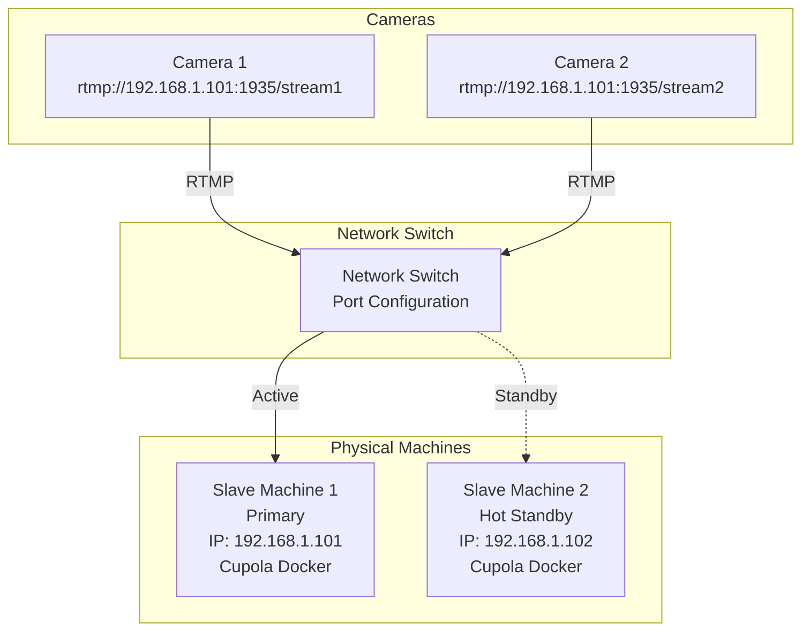
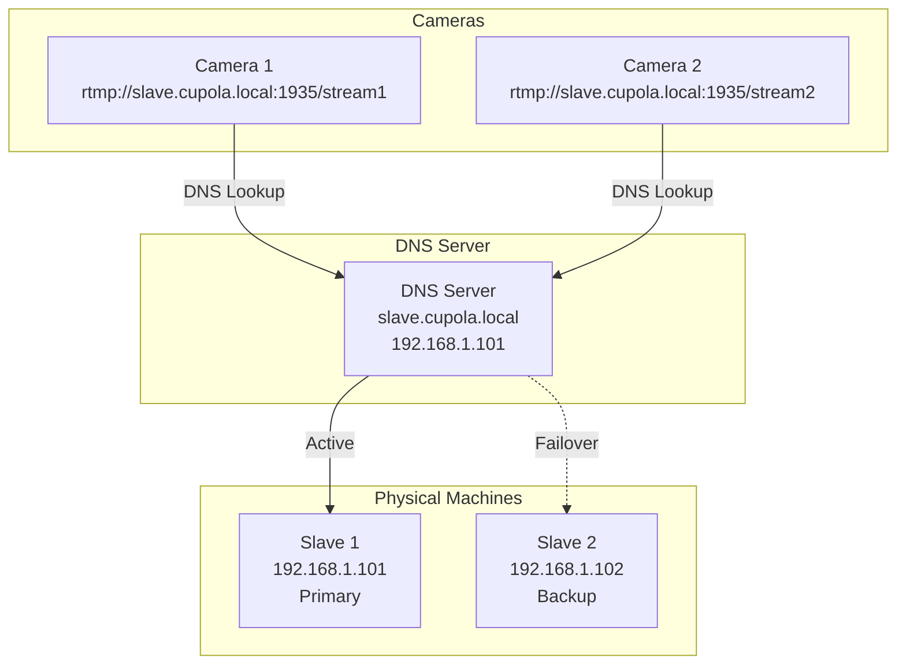
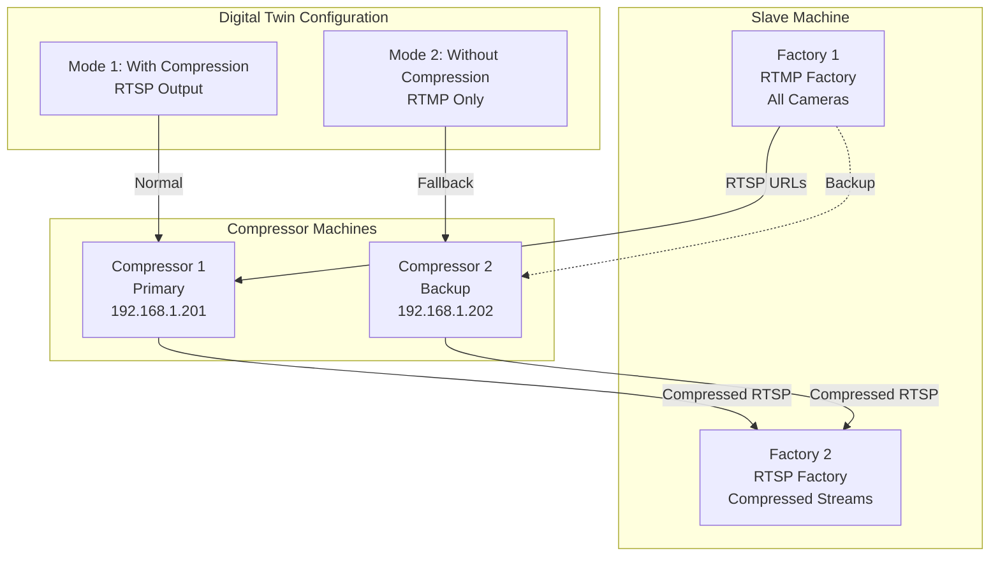
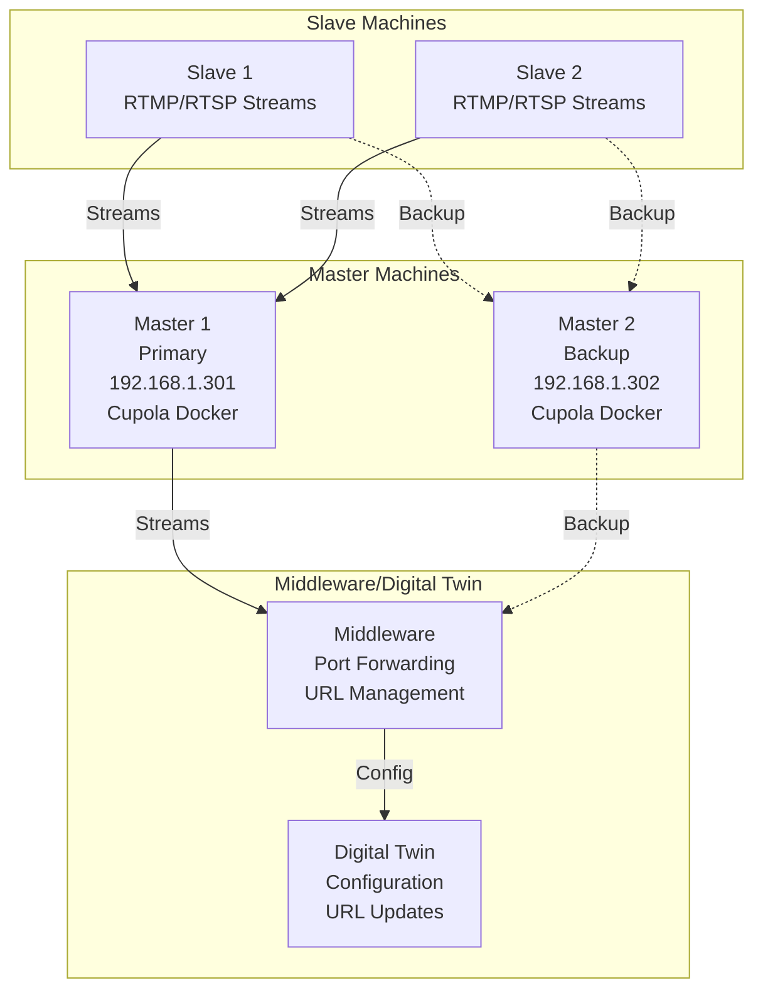
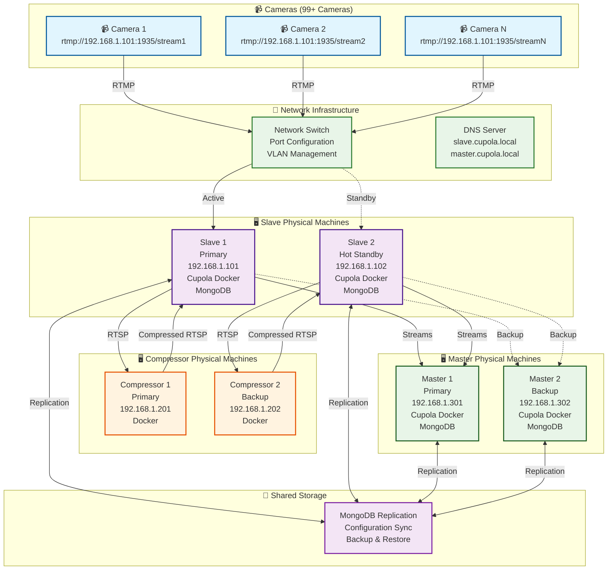

# Physical Machine High Availability Solution for Cupola

## Overview
This document provides practical solutions for physical machine failures in Cupola Docker architecture, focusing on real-world scenarios where machines are physical and not virtualized.

## Physical Machine Failure Scenarios & Solutions

### **Scenario 1: Slave Physical Machine Failure**

#### **Problem**: 
- Physical Slave machine goes down
- All cameras lose RTMP connection
- No automatic failover possible
- Manual intervention required

#### **Solution Options**:

##### **Option A: Hot Standby with Manual Switchover**


**Implementation Steps**:
1. **Keep backup machine running** with Cupola Docker
2. **Sync MongoDB** between machines regularly
3. **When primary fails**:
   - Change network switch port configuration
   - Update camera RTMP URLs (if possible)
   - Start Cupola services on backup
   - **Downtime**: 5-10 minutes

##### **Option B: IP Address Takeover**
```bash
# When Slave 1 (192.168.1.101) fails:
# 1. Change Slave 2 IP to 192.168.1.101
# 2. Restart network services
# 3. Start Cupola Docker
# 4. Cameras automatically reconnect
```

**Steps**:
1. **Physical machine failure** detected
2. **Change backup machine IP** to failed machine's IP
3. **Restart network** services
4. **Start Cupola Docker** containers
5. **Cameras reconnect** automatically (same IP)
6. **Downtime**: 2-3 minutes

##### **Option C: DNS-Based Failover**


**Implementation**:
1. **Use DNS names** instead of IP addresses
2. **Configure DNS failover** (PowerDNS, BIND)
3. **When primary fails**: Update DNS record
4. **Cameras reconnect** automatically
5. **Downtime**: 1-2 minutes

### **Scenario 2: Compressor Physical Machine Failure**

#### **Problem**: 
- Compressor machine goes down
- No compression available
- RTSP streams unavailable

#### **Solution**:


**Implementation**:
1. **Dual patrol modes** in Digital Twin
2. **Mode 1**: With compression (when compressor available)
3. **Mode 2**: Without compression (when compressor down)
4. **Manual switchover** when compressor fails
5. **No impact** on basic RTMP functionality

### **Scenario 3: Master Physical Machine Failure**

#### **Problem**: 
- Master machine goes down
- No automatic failover
- Manual restoration required

#### **Solution**:


**Implementation**:
1. **Keep backup Master running** with Cupola Docker
2. **Sync MongoDB** between Master machines
3. **When primary fails**:
   - Update middleware configuration
   - Change Digital Twin URLs
   - Start services on backup Master
   - **Downtime**: 5-10 minutes

## Complete Physical Machine Architecture



## Implementation Strategy for Physical Machines

### **Phase 1: Hot Standby Setup**
1. **Deploy backup machines** with same configuration
2. **Keep services running** on backup machines
3. **Set up MongoDB replication** between machines
4. **Configure network switch** for easy failover

### **Phase 2: Monitoring & Alerting**
1. **Deploy monitoring** on each machine
2. **Set up alerts** for machine failures
3. **Create failover scripts** for quick recovery
4. **Test failover procedures** regularly

### **Phase 3: Automation**
1. **Create failover scripts** for each scenario
2. **Set up automated backups** of configurations
3. **Implement health checks** for all services
4. **Document recovery procedures**

## Practical Recovery Procedures

### **Slave Machine Failure Recovery**
```bash
# When Slave 1 (192.168.1.101) fails:
# 1. Detect failure (monitoring alert)
# 2. Change Slave 2 IP to 192.168.1.101
# 3. Restart network services
# 4. Start Cupola Docker containers
# 5. Verify camera connections
# 6. Update monitoring

# Commands:
sudo ip addr del 192.168.1.102/24 dev eth0
sudo ip addr add 192.168.1.101/24 dev eth0
sudo systemctl restart networking
docker-compose up -d
```

### **Master Machine Failure Recovery**
```bash
# When Master 1 (192.168.1.301) fails:
# 1. Detect failure (monitoring alert)
# 2. Change Master 2 IP to 192.168.1.301
# 3. Restart network services
# 4. Start Cupola Docker containers
# 5. Update middleware configuration
# 6. Update Digital Twin URLs

# Commands:
sudo ip addr del 192.168.1.302/24 dev eth0
sudo ip addr add 192.168.1.301/24 dev eth0
sudo systemctl restart networking
docker-compose up -d
# Update middleware and Digital Twin configurations
```

### **Compressor Machine Failure Recovery**
```bash
# When Compressor 1 fails:
# 1. Detect failure (monitoring alert)
# 2. Switch to Mode 2 (without compression)
# 3. Update Digital Twin configuration
# 4. Verify RTMP streams working
# 5. Plan compressor replacement

# Commands:
# Update Digital Twin to Mode 2
# Verify RTMP streams are working
# No immediate action needed for basic functionality
```

## Benefits of Physical Machine Solution

### **✅ Realistic Approach**
- **Works with physical hardware**
- **No virtualization required**
- **Cost-effective** solution

### **✅ Quick Recovery**
- **2-3 minutes** for Slave failover
- **5-10 minutes** for Master failover
- **Immediate** for Compressor (fallback mode)

### **✅ Reliable**
- **Proven approach** for physical machines
- **Easy to implement** and maintain
- **Minimal additional** infrastructure

### **✅ Scalable**
- **Easy to add** more backup machines
- **Flexible configuration** options
- **Room for growth**

This solution is specifically designed for physical machines and provides practical, implementable solutions for your Cupola Docker architecture!
